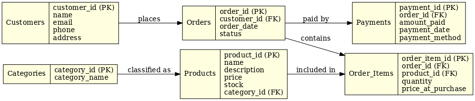

# 🛒 E-commerce Database Schema – SQL Developer Internship Task 1

## 📌 Domain: E-commerce

This project is a relational database schema designed for an e-commerce system. It includes customer, product, order, and payment handling.

---

### 🗂 Tables Included:
- **Customers**
- **Categories**
- **Products**
- **Orders**
- **Order_Items**
- **Payments**

---

### 🔗 Relationships:
- A customer can place many orders.
- Each order can contain multiple products.
- Each product belongs to a category.
- Each order has one payment.

---

### 📁 Files in this Repo:
- `schema.sql` – SQL script to create the database and tables
- `ecommerce_er_diagram_v2.png` – ER diagram of the schema
- `README.md` – This file

---

### 🧰 Tools Used:
- SQL (MySQL compatible)
- ER diagram generated using Graphviz

---

### 📸 ER Diagram

